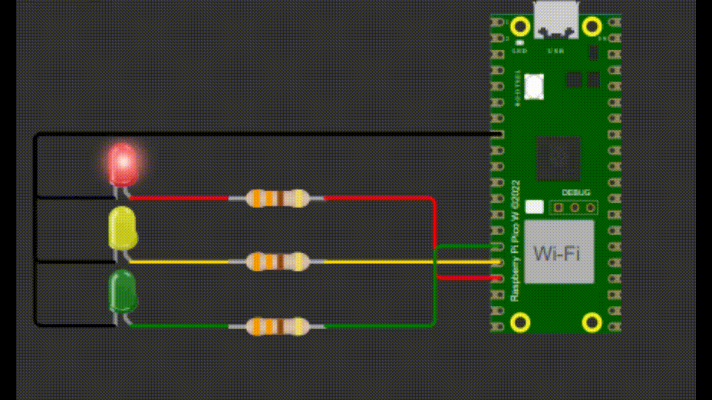

<h1 align="center">Tarefa Semáforo com Temporizador Periódico - Embarcatech 🚦</h1>
    
 
Este projeto implementa um sistema de semáforo utilizando uma placa <strong>Raspberry Pi Pico W</strong> e LEDs controlados por GPIO.

    
<h2>Descrição</h2>
    
O código alterna entre três estados de um semáforo:

    <ul>
        <li>Vermelho</li>
        <li>Amarelo</li>
        <li>Verde</li>
    </ul>
        
O tempo de cada estado é de 3 segundos, com emprego da função <code>add_repeating_timer_ms()</code> e a função de call-back do temporizador <code>repeating_timer_callback()</code> . Além disso, há uma funções de teste que validam o funcionamento do semáforo.

<h2>Importante⚠️</h2>

Esse código foi produzido em um Sistema Operacional Linux. Certifique-se de importar o projeto adequadamente e verificar as configurações do <code>c_cpp_properties.json</code>.

<h2>Componentes Necessários</h2>
    <ul>
        <li>1 x Raspberry Pi Pico W</li>
        <li>1 x LED Vermelho</li>
        <li>1 x LED Amarelo</li>
        <li>1 x LED Verde</li>
        <li>3 x Resistores (330Ω): para limitar as correntes nos LEDs</li>
    </ul>
    
<h2>Funcionamento</h2>
    
O código utiliza os seguintes pinos para os LEDs:

    <ul>
        <li><strong>LED Vermelho</strong>: GPIO 13</li>
        <li><strong>LED Amarelo</strong>: GPIO 12</li>
        <li><strong>LED Verde</strong>: GPIO 11</li>
    </ul>
    
Primeiro será feito o teste dos LEDs, após isso os LEDs acendem e apagam conforme o estado do semáforo em um intervalo de 3 segundos. Além disso, mensagens de depuração são exibidas via <code>printf</code>.

    
<h2>Tecnologias Utilizadas</h2>
  <ul>
    <li>Linguagem C;</li>
    <li>IDE Visual Studio Code;</li>
    <li>Extensão Wokwi Simulator no Visual Studio Code;</li>
    <li>Wokwi Web;</li>
    <li>Pico SDK;</li>
    <li>Placa BitDogLab.</li>  
  </ul>

<h2>Demonstração</h2>
    

<h2>Clone o Repositório</h2>
  <ol>
     <li>Abra o <strong>Prompt de Comando</strong> ou o terminal de sua preferência.</li>
     <li>Clone o repositório usando o Git:
       <pre><code>git clone https://github.com/seu-usuario/seu-repositorio.git</code></pre>
     </li>
      <li>Entre no diretório do projeto:
          <pre><code>cd seu-repositorio</code></pre>
      </li>
  </ol>
  
<h2>Como Compilar e Executar</h2>
    <pre>
    mkdir build
    cd build
    cmake ..
    make
    </pre>
    
Depois, utilize o Wokwi Simulator para executar o projeto no Visual Studio Code ou a placa BitDogLab!

    
<h2>Simulando o projeto no Wokwi Web</h2>
  
Para simular o projeto no Wokwi Web acesse: <a href="https://wokwi.com/projects/421832605027133441" target="_blank">Tarefa Semáforo com Temporizador Periódico</a>.

    
  

